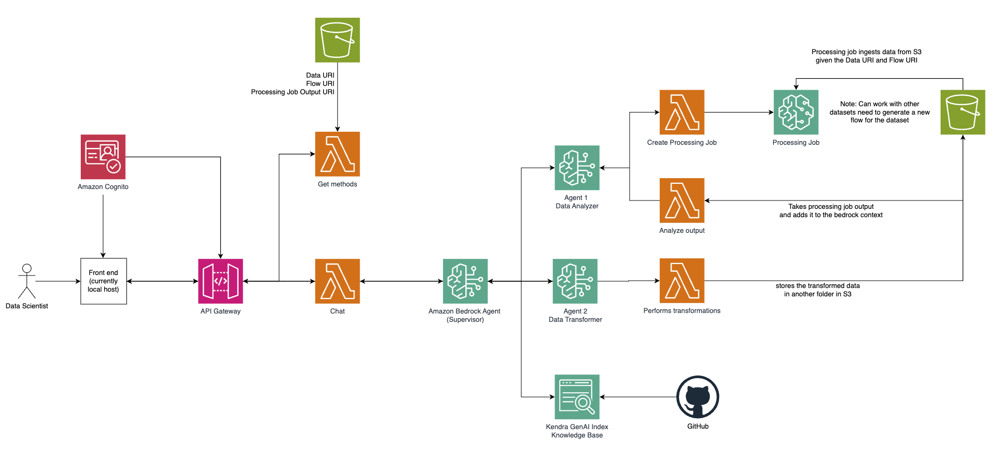

# FSI Fraud Detection with Generative AI

This solution provides a scalable financial fraud detection system powered by generative AI on AWS. It combines real-time transaction monitoring with advanced AI capabilities to detect and prevent fraudulent activities in financial transactions.

# Architecture


## Introduction

The FSI Fraud Detection solution leverages AWS services and generative AI to:
- Process and analyze financial transactions in real-time
- Detect potential fraudulent patterns using machine learning
- Provide interactive fraud investigation capabilities through a React-based web interface
- Secure access through AWS Cognito authentication
- Deploy infrastructure as code using AWS CDK

## Prerequisites

Before deploying this solution, ensure you have the following:

1. **AWS Account Access**
   - An AWS account with administrative permissions
   - AWS CLI installed and configured with your credentials

2. **Development Tools**
   - Node.js 18.x or later
   - npm 8.x or later
   - AWS CDK CLI (can be installed via `npm install -g aws-cdk`)
   - Git (for cloning the repository)

3. **AWS Configuration**
   - A default AWS region selected for deployment (us-east-1 recommended for Bedrock genAI index feature)
   - Sufficient AWS service quotas for services like AWS Lambda, Amazon API Gateway, and Amazon Cognito

## Deployment Instructions

Follow these steps to deploy the solution in your AWS account:

1. **Clone the Repository**
   ```bash
   git clone <repository-url>
   cd scale-fsi-fraud-detection-gen-ai
   ```

2. **Install Dependencies**
   ```bash
   # Install backend dependencies
   cd backend
   npm install
   ```

3. **Deploy the Backend Stack**
   ```bash
   # Ensure you're in the backend directory
   npm run build
   cdk bootstrap <ACCOUNT_ID>/<AWS_REGION>
   cdk synth
   cdk deploy 
   ```
   During deployment, CDK will:
   - Create necessary IAM roles and permissions
   - Deploy Lambda functions
   - Set up API Gateway endpoints
   - Configure Cognito user pool
   - Create required DynamoDB tables

4. **Configure Environment Variables**
   After the stack deployment completes, you'll receive various outputs from CloudFormation. Create a `.env` file in the project root with these values:
   ```
   REACT_APP_AWS_REGION=<your-region>
   REACT_APP_COGNITO_USER_POOL_ID=<user-pool-id>
   REACT_APP_COGNITO_CLIENT_ID=<client-id>
   REACT_APP_COGNITO_DOMAIN=<cognito-domain>
   REACT_APP_REDIRECT_SIGNIN=http://localhost:3000/
   REACT_APP_REDIRECT_SIGNOUT=http://localhost:3000/
   REACT_APP_API_GATEWAY_ENDPOINT=<api-gateway-url>
   ```

5. **Verify Deployment**
   - Check the AWS Console to ensure all resources are created correctly
   - Test the API Gateway endpoints using the provided URLs
   - Verify Cognito user pool configuration

## Post-Deployment Steps

1. **Upload Initial Data Set**
   - Navigate to the Amazon S3 Console
   - Upload the demo_transactions_100k.csv file to the buckets input_data folder

2. **Create Initial Admin User**
   - Navigate to the AWS Cognito Console
   - Select the user pool created by the stack
   - Create a new user with admin privileges

3. **Access the Application**
   ```bash
   cd chatbot-app
   npm start
   ```

   - Use the Cognito credentials to log in
   - Verify all functionality is working as expected

## Cleanup

To avoid incurring unnecessary AWS charges, you can remove the deployed resources:

```bash
cd backend
cdk destroy
```

This will remove all AWS resources created by the stack.

## Support and Contributing

For support, please open an issue in the repository. Contributions are welcome! Please read our contributing guidelines before submitting pull requests.

## License

This project is licensed under the MIT License - see the LICENSE file for details.

## Authors

- Ragib Ahsan, AWS Partner Solutions Architect
- Keith Lee, AWS Partner Solutions Architect
